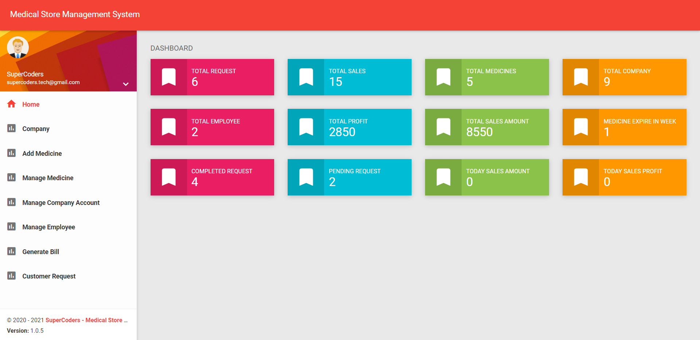
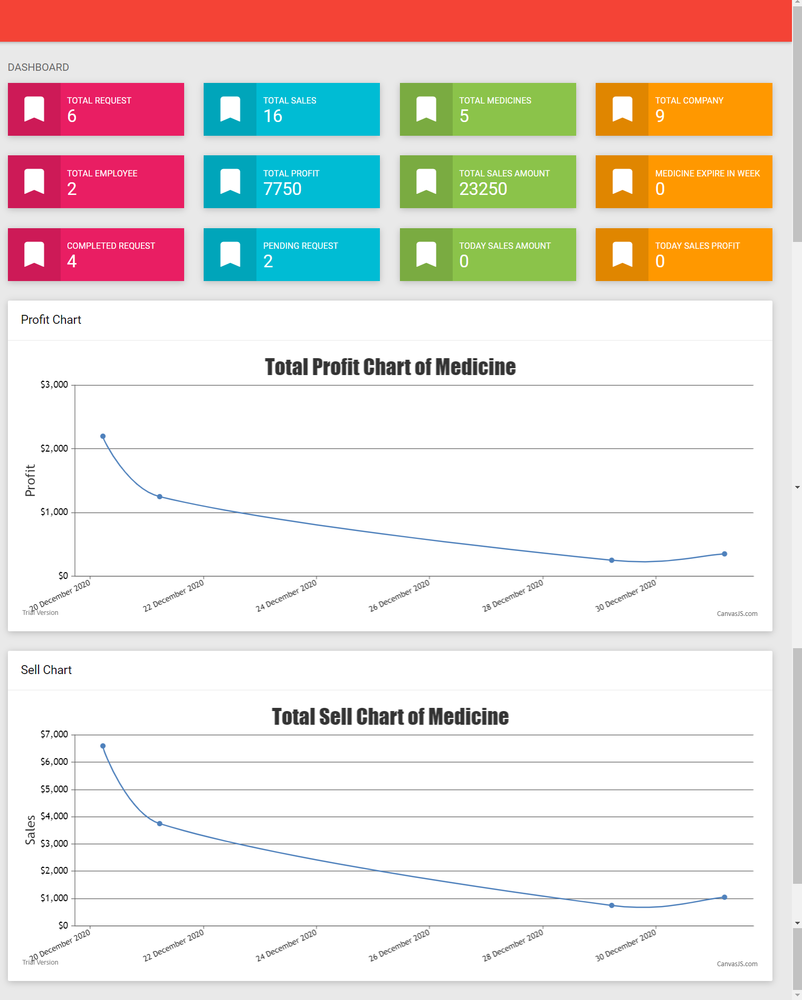

This project was bootstrapped with [Create React App](https://github.com/facebook/create-react-app).

## Live Project LINK 
<a href="https://pacific-falls-18076.herokuapp.com/">https://pacific-falls-18076.herokuapp.com/</a>

## Login DETAILS
<pre>USername : admin</pre>
<pre>Password : admin</pre>

For Deploy React APP in HEROKU

## Signup in HEROKU
<pre>https://dashboard.heroku.com/apps</pre>

## Install React JS
<pre>npm install -g create-react-app</pre>

## Create React APP
<pre>create-react-app my-app</pre>

## Switch to React Project Directory
<pre>cd my-app</pre>

## Intialize Git
<pre>git init</pre>

## Download Heroku Login
<pre>https://devcenter.heroku.com/articles/heroku-cli#download-and-install</pre>

## Login To Heroku
<pre>heroku login</pre>

## Create Project in Heroku
<pre>heroku create -b https://github.com/mars/create-react-app-buildpack.git</pre>

## Add File in Git
<pre>git add .</pre>

## Commit File in git
<pre>git commit -m "react-create-app on Heroku"</pre>

## Push Project to Heroku
<pre>git push heroku master</pre>

## Open Project in URL
<pre>heroku open</pre>

## ============PROJECT DETAILS=============================

## Available Scripts

Install Package by Running Command:

### `npm install`

In the project directory, you can run:

### `npm start`

### For Server Side Django Project Follow This Link.

<a href="https://github.com/hackstarsj/DjangoMedicalStoreManagementSystem">Django Medical Store management System Server Side API</a>

## Login Page Added.

## Dashboard Page Added.

## Add Company Page Added.

## View Company Page Added.

## Edit and Update Company Page Added .

## Add Company Bank Page Added .

## Edit Company Bank Page Added .

## Added Add Medicine Page

## Added Manage Medicine Page

## Added Update Medicine Details

## Added Company Transaction Account

## Added Employee Manage

## Added Employee Manage Complete Edit Employee | Manage Salary and Manage Bank

## Added Bill Generate Form

## Added Bill Generate Print

## Added Customer Request Page

## Added Homepage Part 1

## Added Homepage Part 2 Charts

