This project was bootstrapped with [Create React App](https://github.com/facebook/create-react-app).

## Available Scripts

Install Package by Running Command:

### `npm install`

In the project directory, you can run:

### `npm start`

### For Server Side Django Project Follow This Link.

<a href="https://github.com/hackstarsj/DjangoMedicalStoreManagementSystem">Django Medical Store management System Server Side API</a>

## Login Page Added.

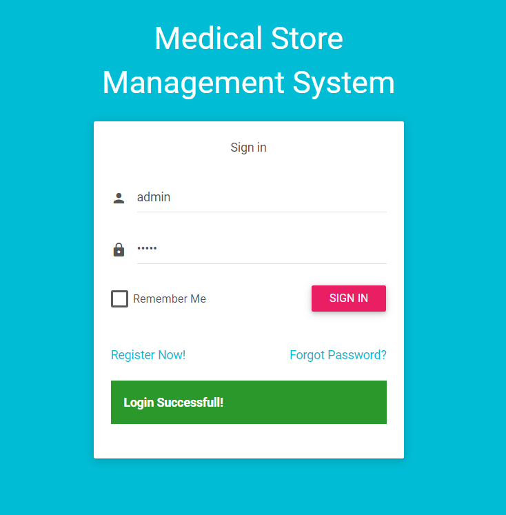

## Dashboard Page Added.

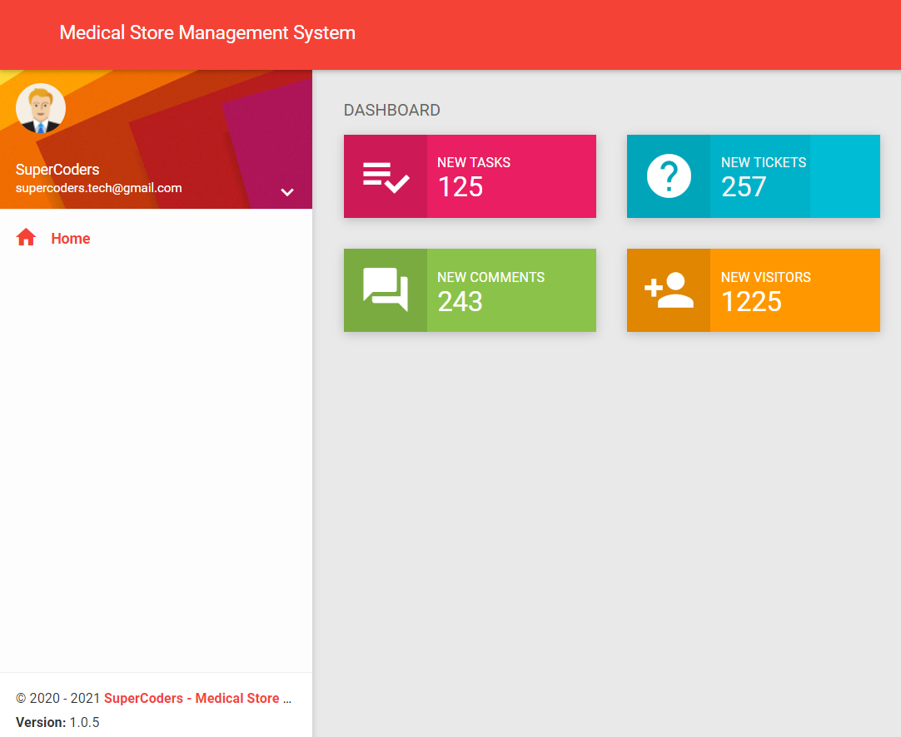

## Add Company Page Added.

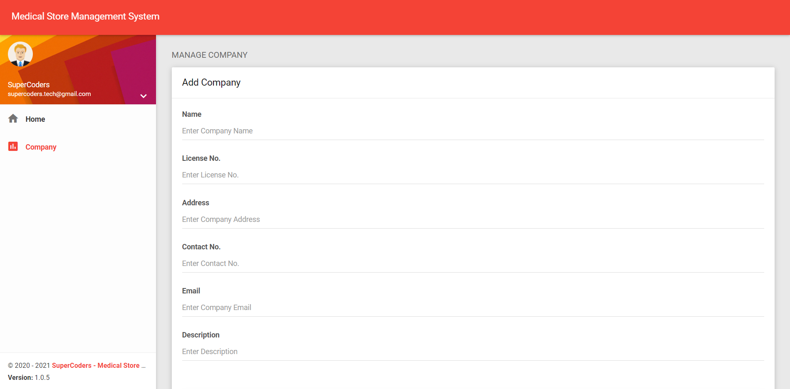

## View Company Page Added.

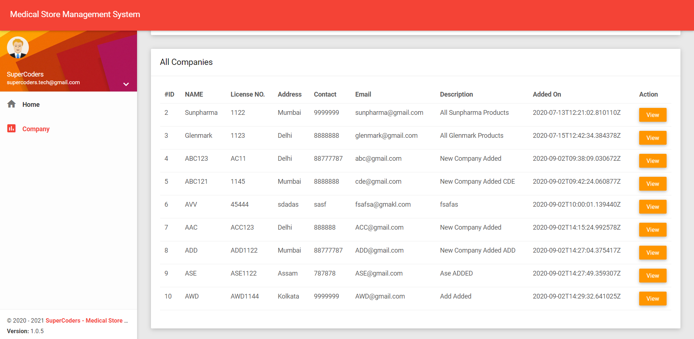

## Edit and Update Company Page Added .

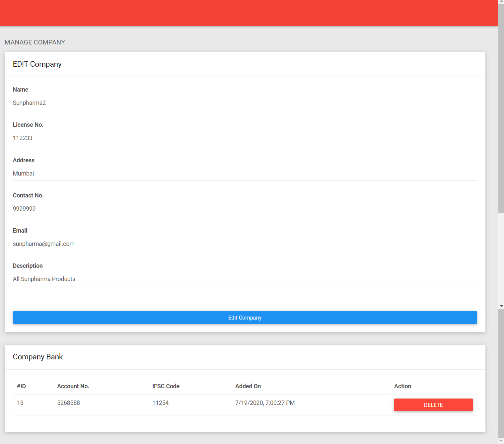

## Add Company Bank Page Added .

## Edit Company Bank Page Added .

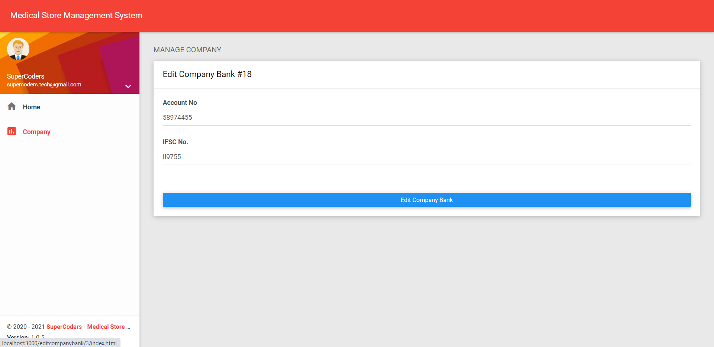

## Added Add Medicine Page

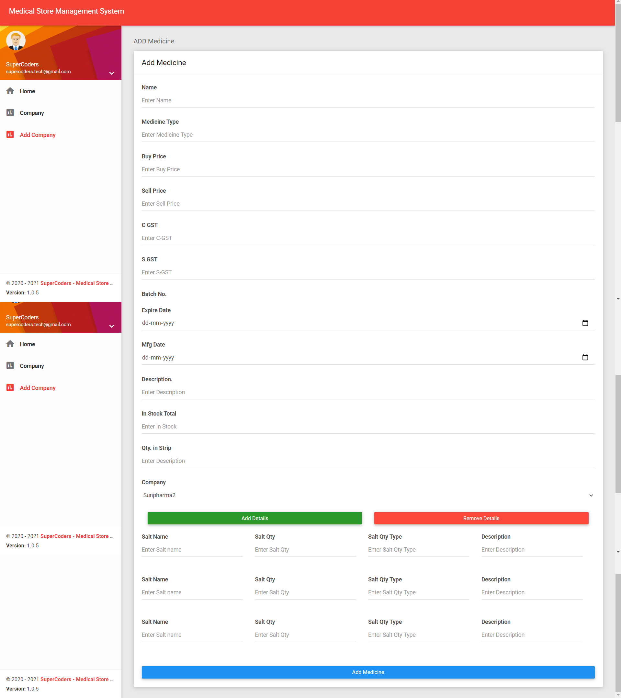

## Added Manage Medicine Page

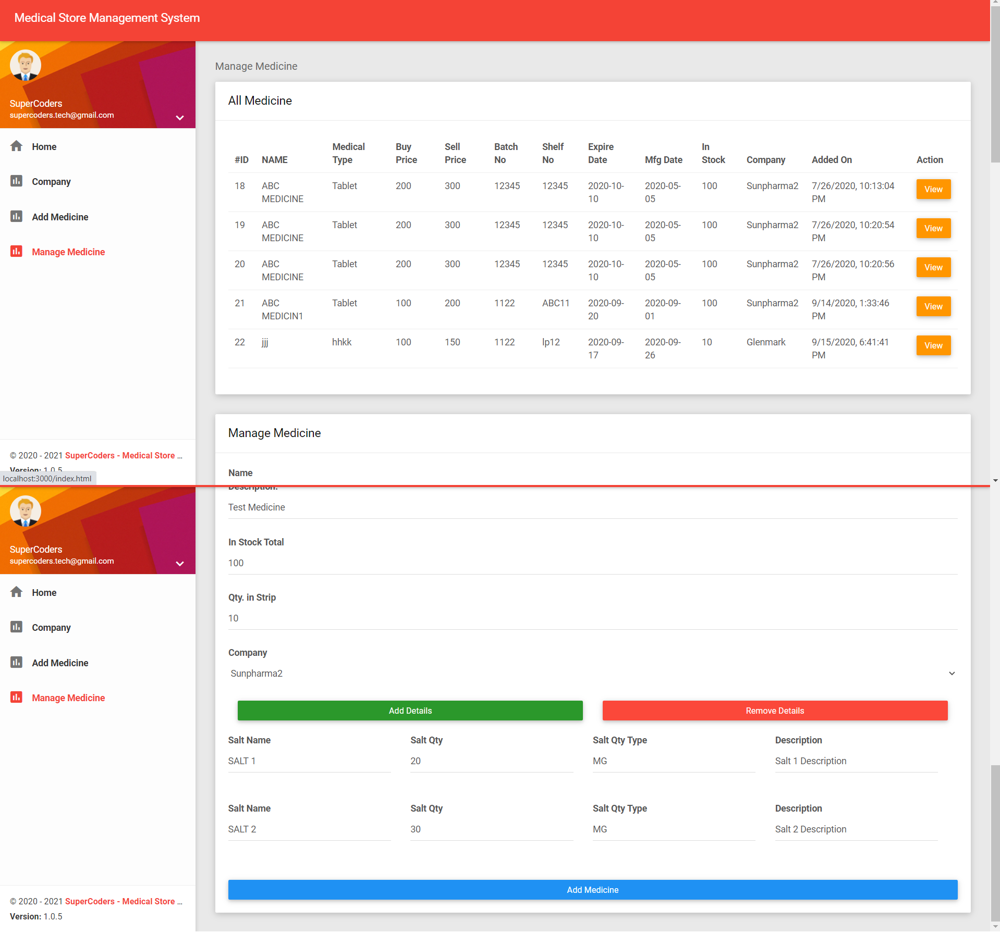

## Added Update Medicine Details

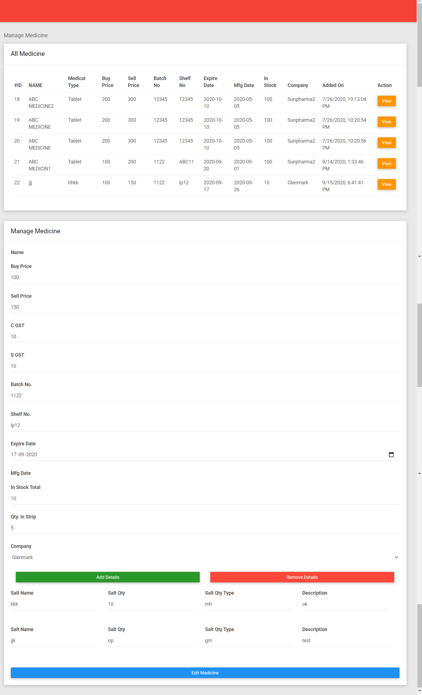

## Added Company Transaction Account

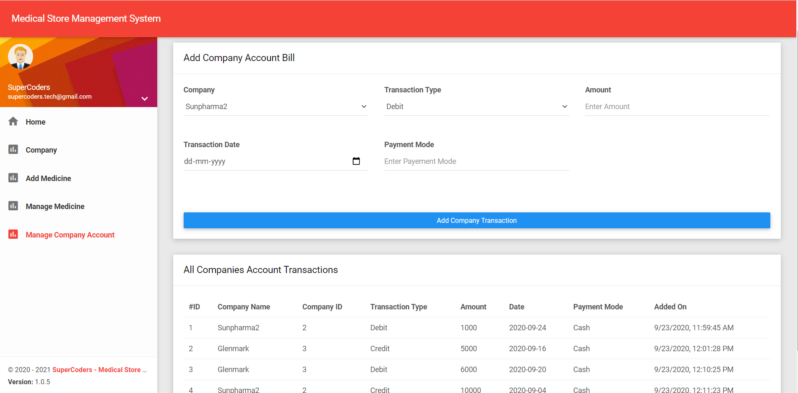

## Added Employee Manage

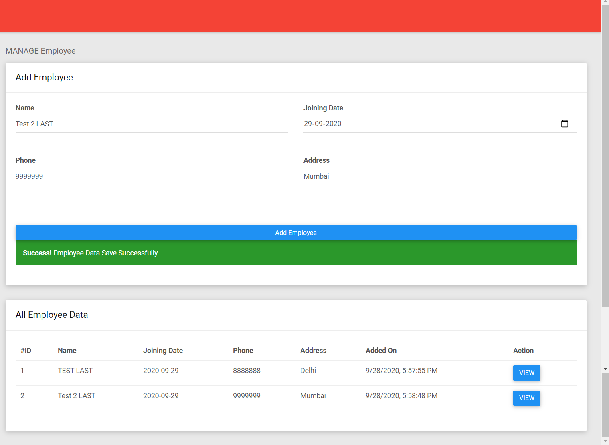

## Added Employee Manage Complete Edit Employee | Manage Salary and Manage Bank

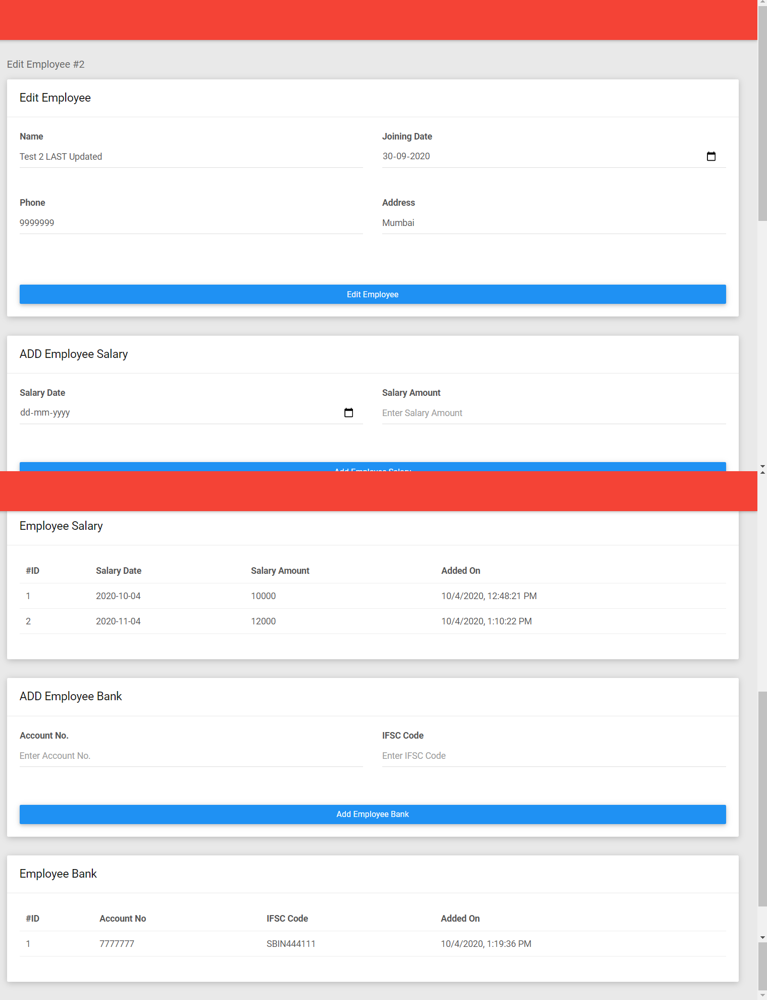

## Added Bill Generate Form

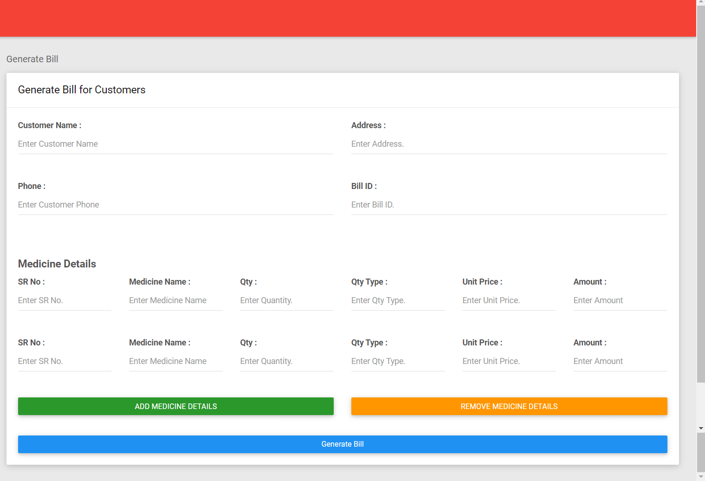

## Added Bill Generate Print

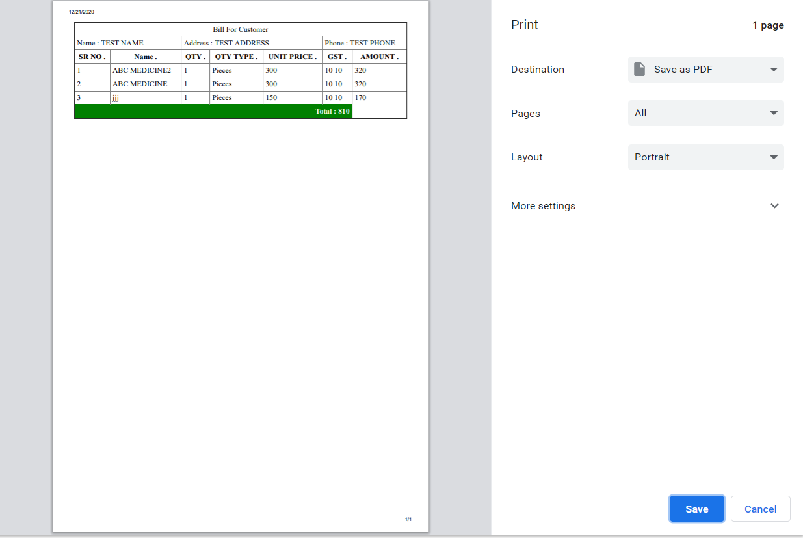

## Added Customer Request Page

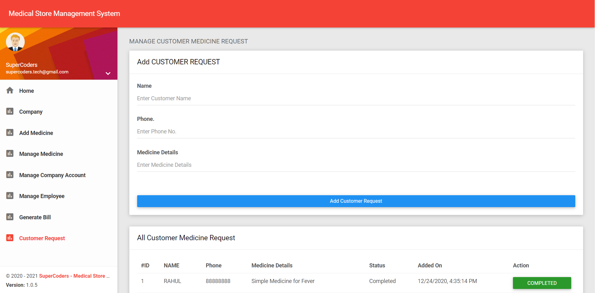
